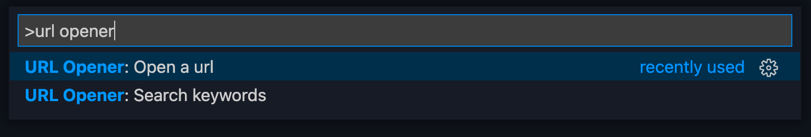
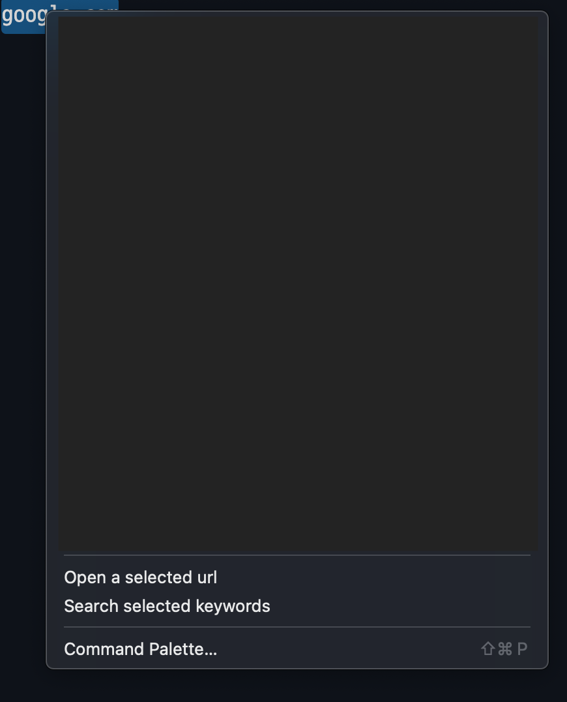
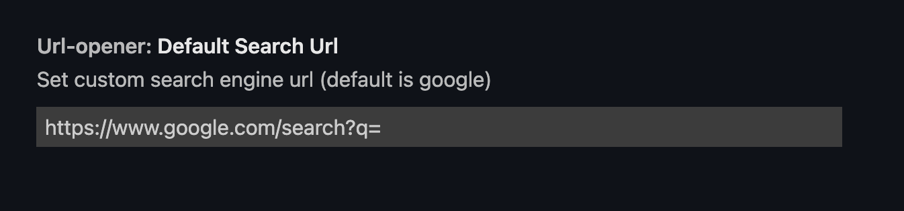

<!-- prettier-ignore -->
# URL Opener
[Download](https://marketplace.visualstudio.com/items?itemName=Young-Vform.url-opener)

Open a URL or search keywords by a default web browser

## Usage

### [Quick pick]

1. Open a url: if you type a url, it would open a url by a default browser.
2. Search keywords: if you type keywords, it would search keywords by a default browser.
 (default search engine is google)
 
 
### [Context menu]   

1. select a url or keywords.
2. right click.
3. Open a selected url: it would open a url by a default browser.
4. Search selected keywords: it would search keywords by a default browser.
  (default search engine is google)
 
 
## Search engine setting

You can change search engine url in the setting
